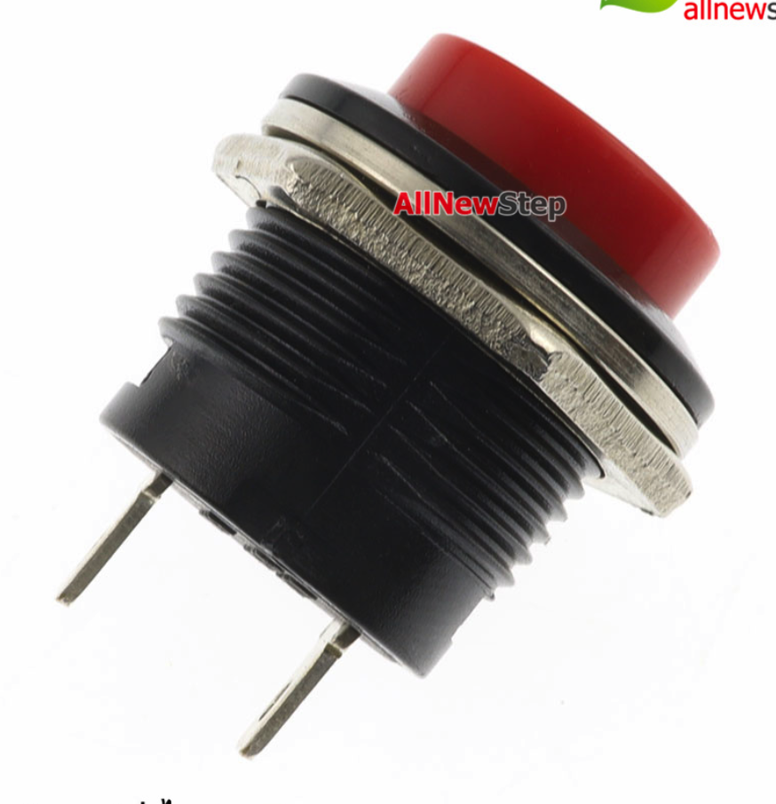

<h1>TempBox</h1>

ส่วนฝากล่อง ขนาด 55x115 

ส่วนกล่อง ขนาด 72.5x115 

<h1>อุปกรณ์</h1>

1.EPS8266 V.2

อ้างอิง

<a href=" ">https://www.allnewstep.com/product/1036/%E0%B8%9A%E0%B8%AD%E0%B8%A3%E0%B9%8C%E0%B8%94%E0%B8%97%E0%B8%94%E0%B8%A5%E0%B8%AD%E0%B8%87-nodemcu-v2-nodemcu-v2-esp8266-development-kit-esp-12e</a>
  

2.BreadBoard

อ้างอิง

<a href=" ">https://www.appsofttech.com/product/237/%E0%B9%81%E0%B8%9C%E0%B8%87%E0%B8%A7%E0%B8%87%E0%B8%88%E0%B8%A3%E0%B8%97%E0%B8%94%E0%B8%A5%E0%B8%AD%E0%B8%87%E0%B8%82%E0%B8%99%E0%B8%B2%E0%B8%94%E0%B9%80%E0%B8%A5%E0%B9%87%E0%B8%81%E0%B8%A3%E0%B8%B8%E0%B9%88%E0%B8%99-170-%E0%B8%88%E0%B8%B8%E0%B8%94%E0%B8%95%E0%B9%88%E0%B8%AD-bread-board</a>
  

3.Relay 5V

อ้างอิง

<a href=" ">https://www.myarduino.net/product/4/%E0%B8%9A%E0%B8%AD%E0%B8%A3%E0%B9%8C%E0%B8%94-relay-1%E0%B8%8A%E0%B9%88%E0%B8%AD%E0%B8%87-5v-relay-module-5v-1-channel-isolation-control-relay-module-shield-250v-10a</a>
  

4.Push Switch

อ้างอิง

<a href=" ">https://www.allnewstep.com/product/4316/r13-507-push-button-switch-16mm-round-reset-switch-%E0%B8%AA%E0%B8%A7%E0%B8%B4%E0%B8%95%E0%B8%8A%E0%B9%8C%E0%B8%81%E0%B8%94%E0%B8%95%E0%B8%B4%E0%B8%94%E0%B8%9B%E0%B8%A5%E0%B9%88%E0%B8%AD%E0%B8%A2%E0%B8%94%E0%B8%B1%E0%B8%9A%E0%B8%AA%E0%B8%B5%E0%B9%81%E0%B8%94%E0%B8%87</a>

5.LED 5mm

อ้างอิง

<a href=" ">https://www.allnewstep.com/product/190/led-%E0%B8%82%E0%B8%99%E0%B8%B2%E0%B8%94-5mm-%E0%B8%AA%E0%B8%B5%E0%B9%81%E0%B8%94%E0%B8%87-led-5mm-%E0%B8%88%E0%B8%B3%E0%B8%99%E0%B8%A7%E0%B8%99-5-%E0%B8%94%E0%B8%A7%E0%B8%87-%E0%B8%84%E0%B8%A5%E0%B8%B0%E0%B9%81%E0%B8%9A%E0%B8%9A</a>
  

6.ขั้วแปลงสายไฟ 

อ้างอิง

<a href=" ">https://shopee.co.th/Coagulatelove-%E2%98%AA2Pcs-Dc-5-5-2-1Mm-Female-Jack-Plug-To-Micro-Usb-5Pin-Male-Power-Converter-i.131626653.5448345227?gclid=Cj0KCQjw-NaJBhDsARIsAAja6dMrld1yp5U0TgmehHViDRWOQsqq55gebdTdIrKwYqPoIyFAuR_0xpAaAoh7EALw_wcB</a>
  

7.สกรูเกลียวมิลหัวกลม 

อ้างอิง

<a href=" ">https://www.thaiwatsadu.com/th/product/%E0%B8%AA%E0%B8%81%E0%B8%A3%E0%B8%B9%E0%B9%80%E0%B8%81%E0%B8%A5%E0%B8%B5%E0%B8%A2%E0%B8%A7%E0%B8%A1%E0%B8%B4%E0%B8%A5%E0%B8%AB%E0%B8%B1%E0%B8%A7%E0%B8%81%E0%B8%A5%E0%B8%A1%7CPan-PAN-SIAM-%E0%B8%A3%E0%B8%B8%E0%B9%88%E0%B8%99-JP-306-%E0%B8%82%E0%B8%99%E0%B8%B2%E0%B8%94-M3-x-6-%E0%B8%A1%E0%B8%A1-%E0%B8%AA%E0%B8%B5%E0%B8%8B%E0%B8%B4%E0%B8%87%E0%B8%84%E0%B9%8C%E0%B8%82%E0%B8%B2%E0%B8%A7-60147153?gclid=Cj0KCQjwm9yJBhDTARIsABKIcGZI1KS-Idp764C7iujLFog2gTW8Em636174pm-hnNlk1kYxrGRhfRAaAjphEALw_wcB</a>
